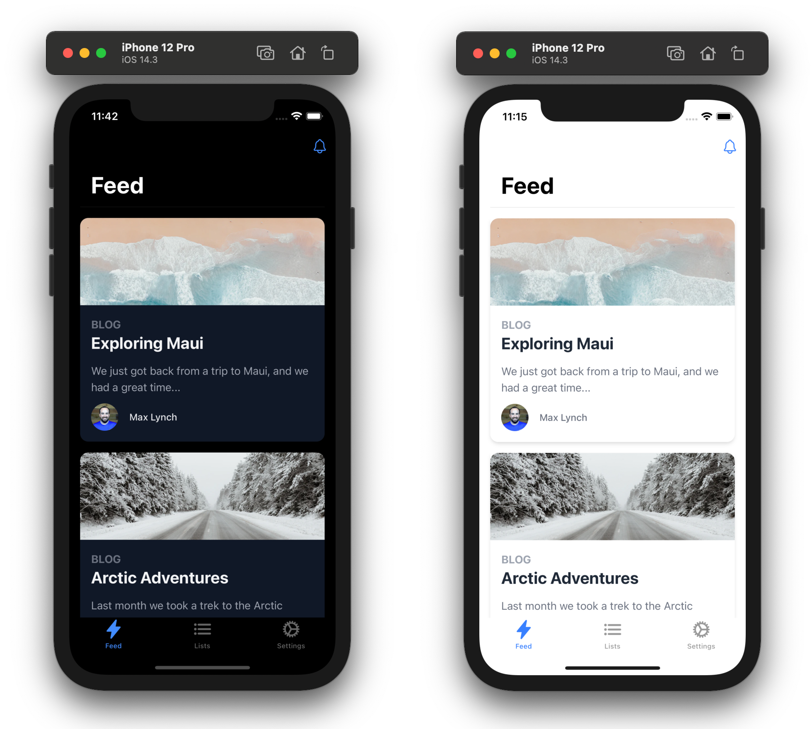

# The World is a Gamebook in Symbol



Symbolブロックチェーン上にゲームブック（番地とメッセージ）を記録・閲覧できるWebアプリケーション。

ユーザーは任意の「番地」を登録し、その番地にメッセージを書き込むことができます。データはすべてSymbolブロックチェーンのトランザクションとして記録されます。

## 技術スタック

- [Next.js](https://nextjs.org/) 14 (Pages Router)
- [Ionic Framework](https://ionicframework.com/) + [React](https://reactjs.org/)
- [Tailwind CSS](https://tailwindcss.com/)
- [Symbol SDK](https://github.com/symbol/symbol-sdk-typescript-javascript) (v1)
- [Capacitor](https://capacitorjs.com/) (iOS/Android対応)

## セットアップ

```bash
npm install
```

## 開発

```bash
npm run dev
```

http://localhost:3000 でアクセスできます。

## ビルド

```bash
npm run build
```

`output: 'export'` により静的ファイルが `out/` ディレクトリに出力されます。

## デプロイ

Vercelにデプロイされています。

- **Staging (テストネット)**: `deploy/staging` ブランチにpush
- **Production (メインネット)**: `deploy/prod` ブランチにpush

### 環境変数

Vercelの環境変数でSymbolノードの設定を切り替えます:

| 変数名 | 説明 |
|---|---|
| `NEXT_PUBLIC_NODE_URL` | SymbolノードのAPIエンドポイント |
| `NEXT_PUBLIC_NUMBERING_ADDRESS` | 番地管理用Symbolアドレス |
| `NEXT_PUBLIC_SYMBOL_EXPLORER` | Symbol ExplorerのベースURL |

## モバイルアプリ (Capacitor)

```bash
npm run build
npx cap copy
npx cap open ios      # iOS
npx cap open android  # Android
```

## ライセンス

MIT
